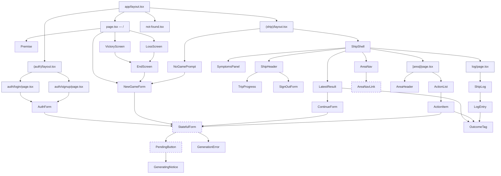

# Component Hierarchy

Part of [plan.md](plan.md). Solid arrows mean "renders". Dashed-border nodes are Client
Components; everything else is a Server Component. Shaded nodes are route files.

`StatefulForm` takes a Server Action and children (fields) from its Server Component parent, and
renders the error from `useActionState` as `GenerationError`. That's how `NewGameForm`,
`ContinueForm`, `ActionItem`, and `AuthForm` stay Server Components. `SignOutForm` is a plain
`<form>` with no pending state. Shared primitives (`Button`, `Panel`, `Badge`) are omitted.
