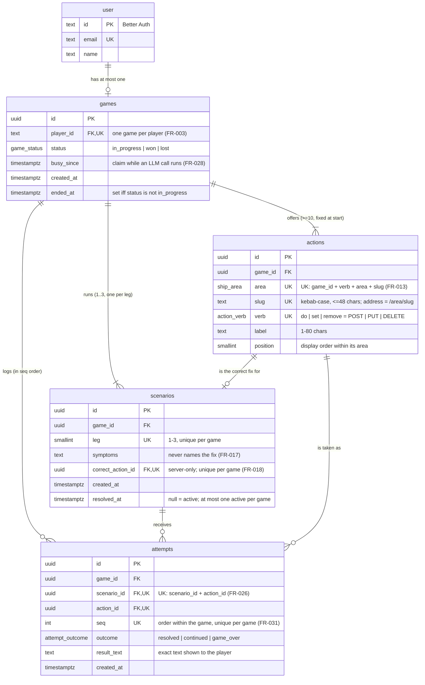

# Data Model: Junker Ship Wedding Run

PostgreSQL 17. This file is the reference; the Drizzle schema in `lib/db/schema.ts` must match
it. Auth tables (`user`, `session`, `account`, `verification`) are owned by Better Auth and are
not repeated here. See [research.md §1](./research.md#1-authentication).

## Entity overview

Crow's-foot notation: `||` exactly one, `o|` zero or one, `|{` one or more, `o{` zero or more.
`PK` primary key, `FK` foreign key, `UK` part of a unique constraint. Every child table's foreign
keys include `game_id`, so an attempt or scenario can only point at rows from its own game. Enum
values are in the [schema](#schema).



Better Auth's other tables (`session`, `account`, `verification`) hang off `user` and are left
out.

| Spec entity | Storage                                                                   |
| ----------- | ------------------------------------------------------------------------- |
| Player      | Better Auth `user`                                                        |
| Game        | `games`                                                                   |
| Ship Area   | `ship_area` enum + `AREAS` constant in `lib/game/areas.ts` (names, order) |
| Action      | `actions`                                                                 |
| Scenario    | `scenarios`                                                               |
| Attempt     | `attempts`                                                                |

**Derived, not stored**: current leg, scenario status (active/resolved), `GameView.status`,
tried actions, and wrong-attempt count per scenario. See [Derived state](#derived-state).

## Schema

```sql
CREATE TYPE ship_area       AS ENUM ('piloting', 'engine-room', 'life-support');
CREATE TYPE action_verb     AS ENUM ('do', 'set', 'remove');   -- POST / PUT / DELETE
CREATE TYPE game_status     AS ENUM ('in_progress', 'won', 'lost');
CREATE TYPE attempt_outcome AS ENUM ('resolved', 'continued', 'game_over');

CREATE TABLE games (
  id         uuid PRIMARY KEY DEFAULT gen_random_uuid(),
  player_id  text NOT NULL UNIQUE REFERENCES "user"(id) ON DELETE CASCADE,  -- FR-003
  status     game_status NOT NULL DEFAULT 'in_progress',
  busy_since timestamptz,          -- claim held while an LLM call runs (FR-028)
  created_at timestamptz NOT NULL DEFAULT now(),
  ended_at   timestamptz,
  CHECK ((status = 'in_progress') = (ended_at IS NULL))
);

CREATE TABLE actions (
  id       uuid PRIMARY KEY DEFAULT gen_random_uuid(),
  game_id  uuid NOT NULL REFERENCES games(id) ON DELETE CASCADE,
  area     ship_area   NOT NULL,
  slug     text        NOT NULL CHECK (slug ~ '^[a-z0-9]+(-[a-z0-9]+)*$' AND length(slug) <= 48),
  verb     action_verb NOT NULL,
  label    text        NOT NULL CHECK (length(label) BETWEEN 1 AND 80),
  position smallint    NOT NULL,   -- display order within its area
  UNIQUE (game_id, verb, area, slug),   -- FR-013
  UNIQUE (game_id, id)
);

CREATE TABLE scenarios (
  id                uuid PRIMARY KEY DEFAULT gen_random_uuid(),
  game_id           uuid NOT NULL REFERENCES games(id) ON DELETE CASCADE,
  leg               smallint NOT NULL CHECK (leg BETWEEN 1 AND 3),
  symptoms          text NOT NULL,
  correct_action_id uuid NOT NULL,
  created_at        timestamptz NOT NULL DEFAULT now(),
  resolved_at       timestamptz,
  UNIQUE (game_id, leg),
  UNIQUE (game_id, correct_action_id),  -- FR-018
  UNIQUE (game_id, id),
  FOREIGN KEY (game_id, correct_action_id) REFERENCES actions (game_id, id)
);
CREATE UNIQUE INDEX scenarios_one_active ON scenarios (game_id) WHERE resolved_at IS NULL;

CREATE TABLE attempts (
  id          uuid PRIMARY KEY DEFAULT gen_random_uuid(),
  game_id     uuid NOT NULL,
  scenario_id uuid NOT NULL,
  action_id   uuid NOT NULL,
  seq         int  NOT NULL CHECK (seq >= 1),   -- order within the game (FR-031)
  outcome     attempt_outcome NOT NULL,
  result_text text NOT NULL,
  created_at  timestamptz NOT NULL DEFAULT now(),
  UNIQUE (game_id, seq),
  UNIQUE (scenario_id, action_id),              -- FR-026
  FOREIGN KEY (game_id, scenario_id) REFERENCES scenarios (game_id, id) ON DELETE CASCADE,
  FOREIGN KEY (game_id, action_id)   REFERENCES actions   (game_id, id) ON DELETE CASCADE
);
```

Indexes: every unique constraint above creates an index that covers the hot lookups: the game by
player, actions by `(game_id, verb, area, slug)`, the active scenario by game, and the attempt by
`(scenario_id, action_id)` and by `(game_id, seq)` for the log. No additional indexes needed.

## Rules enforced in code, not the DB

| Rule                                                                                     | Where                                                                         |
| ---------------------------------------------------------------------------------------- | ----------------------------------------------------------------------------- |
| Action set: every area has ≥3 actions, ≥10 total, slugs not in `RESERVED_SLUGS` (FR-014) | `lib/game/validateGenerated.ts` before insert                                 |
| `outcome = 'resolved'` iff `action_id = scenario.correct_action_id` (FR-021)             | `lib/game/attempts.ts` `decideAttempt`                                        |
| Correct action never gets `game_over` (FR-022)                                           | `applyResult` ignores any game-over flag for correct actions                  |
| Status becomes `won` when leg 3 is resolved; `lost` on `game_over`                       | `applyResult`, written in the same transaction as the attempt                 |
| No attempts accepted unless `status = 'in_progress'` and a scenario is active (FR-029)   | `decideAttempt` + claim `WHERE status = 'in_progress'`                        |
| New scenario only when no scenario is active and the latest leg < 3                      | `gameService.startNextLeg` + `scenarios_one_active` + `UNIQUE (game_id, leg)` |
| `seq` = previous max + 1                                                                 | computed inside the commit transaction, while holding the busy claim          |

## Server-only vs view types

`lib/game/types.ts` defines the domain types, including `Scenario.correctActionId`, which are
used only inside `lib/server` and `lib/game`. The UI receives only the view types
(`GameView`, `ActionView`, `AttemptView`) defined in
[contracts/service-api.md](./contracts/service-api.md). None of them has a field from which the
correct action can be derived (FR-019).

## Derived state

The pure function `toGameView(rows | null): GameView` is the single source for what screens
render:

| `GameView.status` | Condition                                                                                  |
| ----------------- | ------------------------------------------------------------------------------------------ |
| `none`            | no `games` row                                                                             |
| `in-progress`     | `status = 'in_progress'` and a scenario with `resolved_at IS NULL` exists                  |
| `between-legs`    | `status = 'in_progress'`, no active scenario (latest leg resolved, next not yet generated) |
| `won` / `lost`    | `games.status`                                                                             |

- **Leg** = `leg` of the active scenario, otherwise the maximum `leg`.
- **Symptoms** = the active scenario's symptoms, otherwise the most recently resolved one's.
- **Tried actions** (FR-026): `isTriedThisScenario` is true when an attempt exists for the active
  scenario and that action. It's false for every action when no scenario is active.
- **Wrong attempts this scenario** (FR-024, used only in prompts) = the count of attempts on the
  active scenario (while it's active, every one of them was wrong).
- **isEvaluating** = `busy_since` is newer than the 60 s claim timeout. The UI shows a waiting
  notice in other tabs.

## State transitions

```text
                start (actions + scenario 1 generated)
   none ─────────────────────────────────────────────► in-progress(leg 1)
                                                         │
     wrong action, AI: continue ◄────────────────────────┤  (stays active; action marked tried)
                                                         │
     wrong action, AI: game over ────────────────────────┼──► lost ─┐
                                                         │          │
     correct action, leg < 3 ────────────────────────────┼──► between-legs ──continue──► in-progress(leg+1)
                                                         │                (generation failure: stays
     correct action, leg = 3 ────────────────────────────┴──► won ──┐       between-legs, retry)
                                                                     │
   any state ── new game (generated first, then delete + insert) ◄──┴── (win/loss screens, home)
```

Generation failure in any transition leaves the state exactly as it was (FR-027, FR-034).
